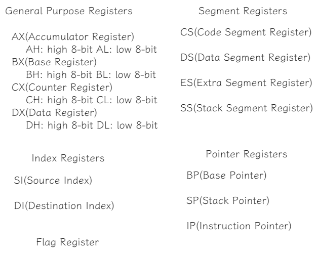

# linux-0.11
Linux version 0.11 source code written by Linus.

## Link

[dibingfa/flash-linux0.11-talk](https://github.com/dibingfa/flash-linux0.11-talk)

[theanarkh/read-linux-0.11](https://github.com/theanarkh/read-linux-0.11)

## Machine

x86

### Hardware

#### CPU

##### Register

[Low Level Programming Basic Concepts](https://www.baskent.edu.tr/~tkaracay/etudio/ders/prg/pascal/PasHTM2/pas/lowlevel.html)

